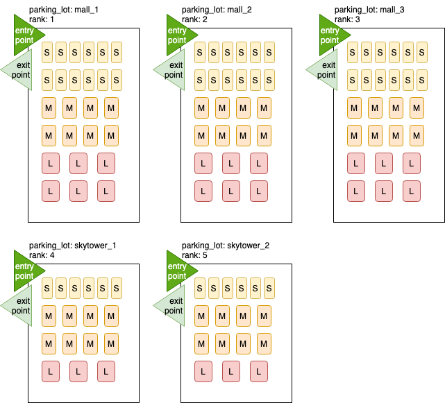

# parking-lot-api

[](https://travis-ci.org/jojoee/parking-lot-api)
[](https://github.com/jojoee/parking-lot-api/issues)
[](https://github.com/jojoee/parking-lot-api/blob/master/LICENSE)

Parking lot API problem design

## Getting started
Install [Docker](https://github.com/docker) + [Docker Compose](https://github.com/docker/compose) then run `docker-compose up`

If you want to run test, so open the new terminal then
```
docker exec -it ctn_parking_lot_api sh
> NODE_ENV=test npx sequelize db:create
> NODE_ENV=test npx sequelize db:migrate
> npm run validate
```

## Assumption



```
- Scenario: free public parking
- Database: MySQL (DBMS)
- Parking lot: support multiple parking lots
  (must be ordered with `rank` property to find *nearest slot*)
- Parking lot: not support multi-level
- Parking lot: only 1 entry point for each parking lot
- Concurrent processes: support by using database transaction feature to handle processes
  (park the vehicle in the same time with different entry point)
- Size:
  - 3 vehicle sizes => small, medium, large
  - 3 slot sizes => small, medium, large
- Ticket and provided slot:
  - Customer nice enough to park in the provided/assigned slot
  - Vehicle must park at the same slot size only
    (e.g. small vehicle park at small slot, medium vehicle park at the medium slot)
  - The ticket system will find the *nearest slot*
    (slot "rank" of each parking lot must be ordered by the distance between
    slot itself and parking lot entry point)
- Pricing strategy: free
- Priority slot: none
- Goal: *fast parking* so searching nearest slot must fast
```

## Algorithm

```
We create *n* stacks for caching available slot ids
(n = number of parking lot * number of slot size)

When we park a car then
1. get stacks
2. check if each stack for specific slot size has available slot ids 
3. if there is available slot then remove the first slot from the stack

When we exit a parking lot
1. get the stack that related to our slot
2. concat *our slot* with *available stack slots* then sort it
3. update the stack with available-sorted-slots from 2)
```

## Model


## API
- [x] POST `/parking_lot` to create parking lot entity
- [x] POST `/vehicle/park` to park a vehicle
- [x] POST `/vehicle/exit` to release a vehicle slot (vehicle leave the parking slot)
- [x] GET `/parking_lot/status` to get available slots of all parking slots
- [x] GET `/ticket?slot_size_id=1` to get ticket by slot size (which contains registration plate numbers / slot numbers)

## Future improvement
- [x] Test: unit test
- [x] Test: E2E test
- [ ] Route parameter validation
- [ ] Docker: `Dockerfile` for development
- [ ] Security concerns e.g. not expose `id` field directly from database
- [ ] Hide 5xx error
- [ ] Encoding e.g. encode ticket id
- [ ] Archive strategy on ticket table that continually increase
- [ ] Load Balancer
- [ ] [Kong API Gateway](https://github.com/Kong/kong#why-kong) for authentication, rate-limit, etc.
- [ ] API: pagination support
- [ ] CI: E2E test
- [ ] CI: deploy coverage report to the service e.g. https://codecov.io/
- [ ] Create example of Kubernetes deployment
- [ ] Create example of Kubernetes service 
- [ ] Distributed storage, incase the data is too big
- [ ] Limitation: where the limit of caching table
- [ ] Database: add index to optimize fast search

## CMD

```
npx sequelize db:create
npx sequelize migration:generate --name create-slot_size-table
npx sequelize migration:generate --name add-index-into-slot_size-table
npx sequelize migration:generate --name create-slot-table
npx sequelize db:seed:all
npx sequelize db:seed:undo:all
npx sequelize db:migrate
npx sequelize db:migrate:undo:all

NODE_ENV=test npx sequelize db:create
NODE_ENV=test npx sequelize db:migrate

docker build --tag parking_lot_api:1.0.0 .
docker run --name ctn_parking_lot_api parking_lot_api:1.0.0
docker exec -it ctn_parking_lot_api sh

docker exec -it ctn_mysql sh
  mysql -u root -p

docker rm ctn_parking_lot_api
docker rm ctn_mysql
docker rmi parking-lot-api:1.0.0
docker-compose up
```

## Reference
- [x] [System Design Interview Question: DESIGN A PARKING LOT - asked at Google, Facebook](https://www.youtube.com/watch?v=DSGsa0pu8-k)
- [x] [Parking Lot - System Design Interview Question](https://www.youtube.com/watch?v=eV5Xh6jNfmU)
- [ ] [Object Oriented Design Interview Question: Design a Car Parking Lot.](https://www.youtube.com/watch?v=2vtT6TBnOAM)
